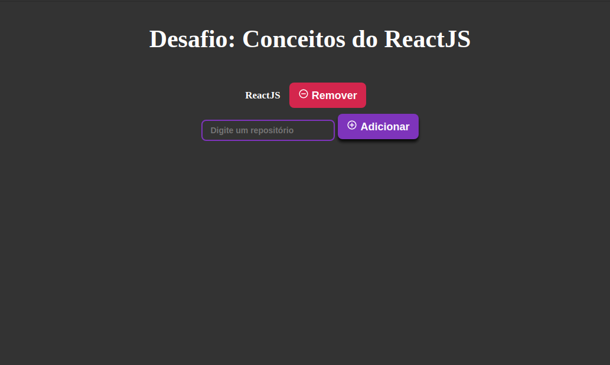
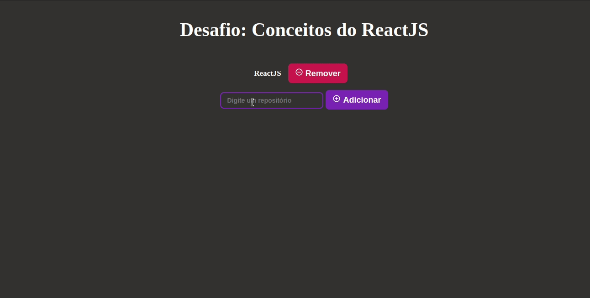

# 🚀 Desafio: Conceitos do ReactJS aplicado no Bootcamp GoStack

## 🔖 Sobre

Nesse desafio era preciso adicionar repositórios na api e mostrar em tela com um botão de remover, que remove tanto em tela quanto na api.

## 📷 Screenshot:

### Além do desafio

💻 Adicionei um tema diferente para a página.

💻 Adicionei ícones e animações aos botões.

    
    

# 🚀 Tecnologias
<ul>
    <li>✔️ ReactJS</li>
    <li>✔️ NodeJS</li>
    <li>✔️ Express</li>
    <li>✔️ Axios</li>
</ul>

# 

<h3 align="center"> Made with 💜 by <a href="https://www.linkedin.com/in/pedro-lucas-4b2941199/">Pedro Lucas</a></h3>